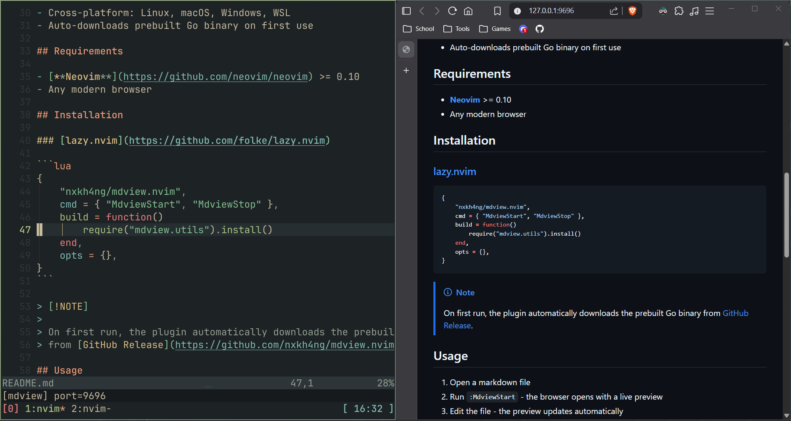
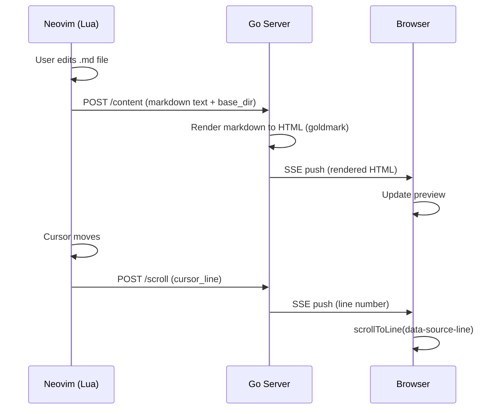

# mdview.nvim

> Live markdown preview in your browser.



## Features

### Live preview

- Real-time markdown preview in browser - content updates
  as you type via [SSE](https://en.wikipedia.org/wiki/Server-sent_events)
- Zero-latency scroll sync - cursor position in Neovim mirrors to browser

### Markdown rendering

- Github Flavored Markdown:
  - Tables
  - Task lists
  - Strikethrough
  - Definition lists
  - Auto-links
  - Alerts: NOTE, TIP, IMPORTANT, WARNING, CAUTION
- Syntax highlighting for code blocks (light + dark themes)
- Preview local images, links to other files - relative paths
  resolved automatically

### Works out of the box

- Cross-platform: Linux, macOS, Windows, WSL
- Auto-downloads prebuilt Go binary on first use

## Requirements

- [**Neovim**](https://github.com/neovim/neovim) >= 0.10
- Any modern browser

## Installation

### [lazy.nvim](https://github.com/folke/lazy.nvim)

```lua
{
    "nxkh4ng/mdview.nvim",
    cmd = { "MdviewStart", "MdviewStop" },
    build = function()
        require("mdview.utils").install()
    end,
    opts = {},
}
```

> [!NOTE]
>
> On first run, the plugin automatically downloads the prebuilt Go binary
> from [GitHub Release](https://github.com/nxkh4ng/mdview.nvim/releases).

## Usage

1. Open a markdown file
2. Run `:MdviewStart` - the browser opens with a live preview
3. Edit the file - the preview updates automatically
4. Move the cursor - the browser scrolls to the corresponding section
5. Run `:MdviewStop` to stop the server

## Configuration

```lua
-- default config:
require("mdview").setup({
    -- address the Go server binds to
    host = "127.0.0.1",

    -- port number
    -- 0 = random available port
    port = 0,

    -- browser command, empty = system default
    -- examples: "firefox", "chromium", "brave-browser",...
    browser = "",

    -- wait after typing before updating preview
    -- lower = more responsive, higher = less overhead
    debounce_ms = 50,

    -- max request body size in MB
    -- larger values allow bigger markdown files but risk OOM
    max_mb_body_size = 10,

    -- max seconds to wait for markdown rendering before timeout
    -- increase if you use complex content (LaTeX, mermaid diagrams, etc.)
    render_timeout_sec = 10,

})
```

## How it works



- `mdview.nvim` uses a Go HTTP server that runs alongside Neovim.
- Lua plugin watches `TextChanged/I` / `CursorMoved/I`,
  sends buffer content and cursor position via raw TCP (no `curl`)
- Go server listens on `127.0.0.1:random`,
  renders markdown with [goldmark](https://github.com/yuin/goldmark),
  broadcasts to all browser tabs via [SSE](https://en.wikipedia.org/wiki/Server-sent_events)
- Browser connects via `EventSource`,
  receives HTML and scroll events in real-time
- Local assets (images, links) are resolved relative to the markdown file's directory and
  served by the Go server

## License

[MIT](./LICENSE)
